# Learn JavaScript, TypeScript & Playwright (4x)


A chapter-by-chapter learning repo for testers moving into JavaScript, TypeScript, and Playwright automation. Every chapter is a folder, every lesson is a small file you can run on its own.

---

## Table of Contents

- [Roadmap](#roadmap)
- [Chapter Summary](#chapter-summary)
- [Project Structure](#project-structure)
- [Getting Started](#getting-started)
- [Chapter 00: Prompt Engineering](#chapter-00-prompt-engineering)
  - [00: RICE-POT Prompt Engineering](#00-rice-pot-prompt-engineering)
- [Chapter 01: JavaScript Basics](#chapter-01-javascript-basics)
  - [01: Hello World](#01-hello-world)
  - [02: Math with Numbers](#02-math-with-numbers)
- [Chapter 02: Keywords and Identifiers](#chapter-02-keywords-and-identifiers)
  - [03: The JavaScript Engine](#03-the-javascript-engine)
  - [05: Keywords vs Identifiers: var, let, const](#05-keywords-vs-identifiers-var-let-const)
  - [06: Identifier Rules](#06-identifier-rules)
  - [07: Naming Conventions](#07-naming-conventions)
  - [08: Comments](#08-comments)
  - [09: Interview Questions on Identifiers](#09-interview-questions-on-identifiers)
- [Chapter 03: Literals](#chapter-03-literals)
  - [10: Literals and typeof](#10-literals-and-typeof)
  - [12: null vs undefined](#12-null-vs-undefined)
  - [14: Number Literals: Bases and Exponents](#14-number-literals-bases-and-exponents)
  - [16: Numeric Separators and BigInt](#16-numeric-separators-and-bigint)
  - [17: Special Numbers: Infinity and NaN](#17-special-numbers-infinity-and-nan)
- [Chapter 04: Operators](#chapter-04-operators)
  - [19: Expressions and Data Types](#19-expressions-and-data-types)
  - [20: Assignment Operators](#20-assignment-operators)
  - [21: Arithmetic Operators](#21-arithmetic-operators)
  - [22: Comparison Operators (Loose vs Strict)](#22-comparison-operators-loose-vs-strict)
  - [23: Logical Operators](#23-logical-operators)
  - [24: Confusing Comparisons](#24-confusing-comparisons)
- [Coming Up](#coming-up)

---

## Roadmap

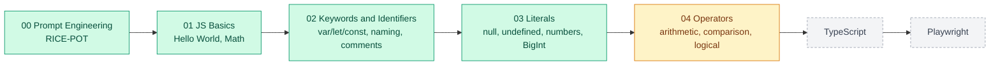

---

## Chapter Summary

| # | Chapter | Folder | Status | What you learn |
|:--|:--------|:-------|:------:|:---------------|
| 00 | Prompt Engineering | [00_chapter_Prompt_Eng](00_chapter_Prompt_Eng/) | ✅ Done | RICE-POT prompts, anti-hallucination rules, the Selenium framework a prompt generated |
| 01 | JavaScript Basics | [01_chapter_JS_Basics](01_chapter_JS_Basics/) | ✅ Done | Running a file with Node, `console.log`, arithmetic expressions |
| 02 | Keywords and Identifiers | [02_chapter_JS_Keywrods_Identifiers](02_chapter_JS_Keywrods_Identifiers/) | ✅ Done | How V8 runs code, `var`/`let`/`const`, identifier rules, naming conventions, comments |
| 03 | Literals | [03_chapter_JS_Literals](03_chapter_JS_Literals/) | ✅ Done | `typeof`, `null` vs `undefined`, number bases, exponents, numeric separators, BigInt, `Infinity`, `NaN` |
| 04 | Operators | [04_chapter_JS_Operators](04_chapter_JS_Operators/) | 🟡 In progress | Data types, assignment, arithmetic, `==` vs `===`, `&&` `\|\|` `!`, coercion traps |

---

## Project Structure

```text
LearnJSTSPlaywright4x/
├── README.md
├── .gitignore
├── 00_chapter_Prompt_Eng/
│   ├── 00_RICE_POT_FullForm.md             # What each RICE-POT letter means
│   ├── 01_RICE_POT_Prompt.md               # Worked prompt: Salesforce login (Selenium + TestNG)
│   ├── 02_Problem_Statement.md             # The objective the prompt solves
│   ├── 03_Anti_Hallucinations.md           # Version anchors, negative constraints, self-checks
│   ├── 04_RICE_POT_Generic_QA_Template.md  # Reusable template: test plans, cases, automation
│   └── Selenium_Framework/                 # The framework the prompt produced (Java 17, TestNG)
├── 01_chapter_JS_Basics/
│   ├── 01_HelloWorld.js                    # First program: console.log
│   └── 02_Math.js                          # Arithmetic expressions
├── 02_chapter_JS_Keywrods_Identifiers/
│   ├── 03_js_engine.js                     # How V8 runs a file, hot code and JIT
│   ├── 04_letengine.js                     # Smallest program: one let declaration
│   ├── 05_KW_IND.js                        # Keyword vs identifier: var, let, const
│   ├── 06_KW_IND_Rules.js                  # Identifier rules: what a name may contain
│   ├── 07_IND_Rules2.js                    # Naming conventions: camelCase, PascalCase, ...
│   ├── 08_Comments.js                      # Single-line, multi-line and JSDoc comments
│   └── 09_IQ.js                            # Interview drill: valid vs invalid identifiers
├── 03_chapter_JS_Literals/
│   ├── 10_Literal.js                       # A literal is the value you write: let a = 10
│   ├── 11_Numberal.js                      # String, number, boolean, null literals + typeof
│   ├── 12_Null_Undefined.js                # null vs undefined, typeof null is "object"
│   ├── 13_Null.js                          # Practice: a null and an undefined variable
│   ├── 14_Literals.js                      # Integers, hex, octal, exponent literals
│   ├── 15_Number.js                        # Binary, octal, hex, floats, exponential notation
│   ├── 16_Numbers_PART2.js                 # Numeric separators (1_000_000) and BigInt
│   ├── 17_Special.js                       # Infinity, -Infinity, NaN
│   └── 18_undefined.js                     # Practice: undefined vs null
└── 04_chapter_JS_Operators/
    ├── 19_Arch.js                          # Anatomy of an expression, JS data types
    ├── 20_Assigment_Op.js                  # = and reassigning a variable
    ├── 21_Arithematic_Op.js                # + - * / % ** and the odd/even check
    ├── 22_Comparsion_Op.js                 # == vs ===, != vs !==
    ├── 23_Logical_Op.js                    # && || !
    ├── 24_Confusing_Comparsion.js          # "" == 0, "0" == 0, "" == "0"
    └── 25_CC.js                            # (empty, work in progress)
```

---

## Getting Started

You only need [Node.js](https://nodejs.org/) 18 or newer. No `npm install` yet.

```bash
git clone https://github.com/PramodDutta/LearnJSTSPlaywright4x.git
cd LearnJSTSPlaywright4x
node --version                              # v18+ (tested on v22)
node 01_chapter_JS_Basics/01_HelloWorld.js  # Hello World!
```

Every lesson file runs the same way: `node <chapter folder>/<file>.js`.

---

## Chapter 00: Prompt Engineering

### 00: RICE-POT Prompt Engineering

**Concept:** RICE-POT is a seven-part prompt template (**R**ole, **I**nstructions, **C**ontext, **E**xample, **P**arameters, **O**utput, **T**one) for getting production-quality test artifacts out of an LLM instead of toy snippets.

**Why:** A one-line prompt like "write Selenium code" gets you outdated APIs and invented methods; RICE-POT plus explicit anti-hallucination rules pins the model to real versions, real patterns, and a fixed output shape.

**Q&A: why use this?**
- **Q: When do I reach for it?** A: Any time you ask an AI for a framework, test plan, or test cases. The [generic QA template](00_chapter_Prompt_Eng/04_RICE_POT_Generic_QA_Template.md) covers all four task types.
- **Q: What does it replace?** A: Ad-hoc, one-line prompts that leave the model to guess your stack, your versions, and what "done" looks like.
- **Q: What's the gotcha?** A: A well-structured prompt can still produce invented APIs. Pin library versions and add "do NOT" rules ([03_Anti_Hallucinations.md](00_chapter_Prompt_Eng/03_Anti_Hallucinations.md)), then review the code before trusting it.

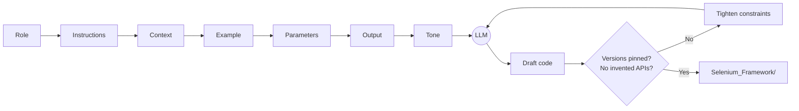

The anti-hallucination block from [03_Anti_Hallucinations.md](00_chapter_Prompt_Eng/03_Anti_Hallucinations.md), ready to paste under any RICE-POT prompt:

```markdown
Role: Senior SDET Automation Architect.
Task: Generate a test automation script for [Application/Workflow].

Constraints & Anti-Hallucination Rules:
1. Version Anchors: Java 17+, Selenium 4.x, TestNG 7.x.
2. Deprecation Checks:
   - Use `java.time.Duration` for timeouts.
   - Use `ChromeOptions` / `FirefoxOptions` (no `DesiredCapabilities`).
   - Use `WebDriverWait(driver, Duration.ofSeconds(x))` (no two-argument timeout with integer and TimeUnit).
3. Grounding: Rely strictly on standard Selenium 4 API calls. Do not invent custom methods on WebDriver or WebElement.
4. Completeness: Ensure all import statements are fully qualified and valid.
```

The full result of this prompt lives in [Selenium_Framework/](00_chapter_Prompt_Eng/Selenium_Framework/README.md).

---

## Chapter 01: JavaScript Basics

### 01: Hello World

**Concept:** `console.log()` prints a value to the output. Run a `.js` file with `node <file>` and whatever you log appears in your terminal.

**Why:** Before variables, functions, or Playwright, you need one reliable way to see what your code is doing, and `console.log` is that tool.

**Q&A: why use this?**
- **Q: When do I reach for it?** A: Whenever you want to see a value while learning or debugging. In Playwright tests it is the first debugging tool you will use, long before the trace viewer.
- **Q: What does it replace?** A: Java's `System.out.println` or Python's `print`. Same idea, but JavaScript needs no class and no `main` method: one line is a whole program.
- **Q: What's the gotcha?** A: Where the output lands depends on where the code runs. With `node` it prints to your terminal; inside the browser (for example in Playwright's `page.evaluate`) it prints to the browser's DevTools console instead.

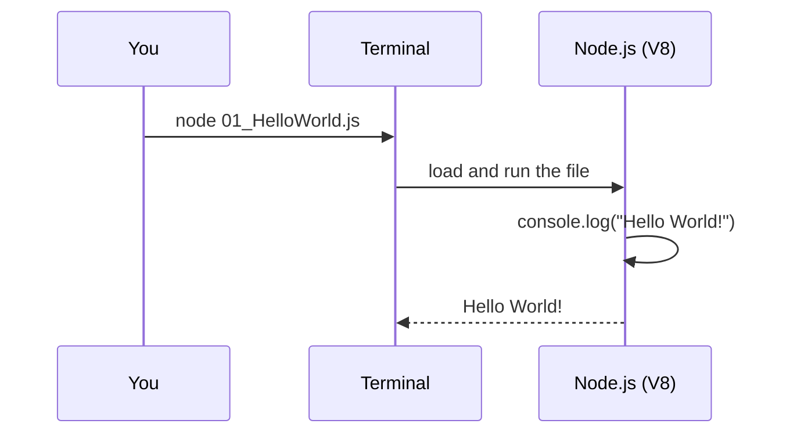

```js
// 01_chapter_JS_Basics/01_HelloWorld.js
console.log("Hello World!");
```

```bash
$ node 01_chapter_JS_Basics/01_HelloWorld.js
Hello World!
```

### 02: Math with Numbers

**Concept:** JavaScript evaluates an expression like `1+2` first and then hands the result to `console.log`, so you see `3`, not the text `1+2`.

**Why:** Tests constantly compute expected values (cart totals, row counts, page numbers), so you need to know how JavaScript does arithmetic before you assert on it.

**Q&A: why use this?**
- **Q: When do I reach for it?** A: Calculating an expected value inside a test, for example `expect(total).toBe(price * qty)` instead of hard-coding the answer.
- **Q: What does it replace?** A: Working numbers out by hand or in a calculator and pasting them into test data, which breaks as soon as the inputs change.
- **Q: What's the gotcha?** A: `+` is overloaded. If either side is a string it concatenates: `"1" + 2` gives `"12"`. Also, every JavaScript number is a 64-bit float, so `0.1 + 0.2` prints `0.30000000000000004`.

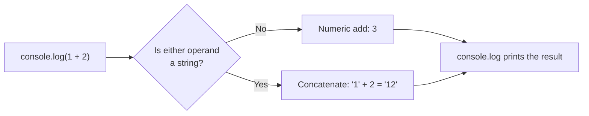

```js
// 01_chapter_JS_Basics/02_Math.js
console.log(1+2);
console.log(2*2);
```

```bash
$ node 01_chapter_JS_Basics/02_Math.js
3
4
```

| Operator | Meaning | Example | Result |
|:--------:|:--------|:--------|:------:|
| `+` | Add (or concatenate strings) | `1 + 2` | `3` |
| `-` | Subtract | `5 - 2` | `3` |
| `*` | Multiply | `2 * 2` | `4` |
| `/` | Divide (always a float) | `7 / 2` | `3.5` |
| `%` | Remainder | `7 % 2` | `1` |
| `**` | Power | `2 ** 3` | `8` |

---

## Chapter 02: Keywords and Identifiers

### 03: The JavaScript Engine

**Concept:** `node` hands your file to V8, Google's JavaScript engine. V8 parses the whole file, turns it into bytecode, runs that in an interpreter (Ignition), and recompiles "hot" code, code that runs many times like a loop body, into fast machine code (TurboFan). This is Just-In-Time (JIT) compilation.

**Why:** Knowing that JavaScript is compiled just in time, not read line by line, explains why a single syntax error stops the whole file and why loops get faster the longer they run.

**Q&A: why use this?**
- **Q: When do I reach for it?** A: When a file fails with `SyntaxError` and nothing prints, not even the `console.log` on line 1. V8 parses the entire file before it runs any of it.
- **Q: What does it replace?** A: The idea that JavaScript is "just interpreted". V8 interprets first, then optimises the hot paths, and drops back to the interpreter (deoptimises) if its assumptions about your values break.
- **Q: What's the gotcha?** A: The hot-code loop in `03_js_engine.js` is commented out for a reason: 100,000 iterations, each calling `console.log` twice, floods the terminal. It also calls `badCodeFn()` before the function is written, which works because function declarations are hoisted.

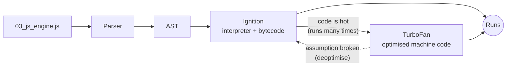

```js
// 02_chapter_JS_Keywrods_Identifiers/03_js_engine.js
let a = 10;
console.log(a);

// Hot Code
//  for (let a = 0; a < 100000; a++) {
//     console.log(a);
//     badCodeFn();
// }

// function badCodeFn() {
//     console.log("Hello");
// }
```

```bash
$ node 02_chapter_JS_Keywrods_Identifiers/03_js_engine.js
10
```

`04_letengine.js` is the smallest program you can feed the engine: a single `let x = 10;`. It prints nothing, but V8 still parses, compiles and runs it.

### 05: Keywords vs Identifiers: var, let, const

**Concept:** A keyword is a word the language owns (`var`, `let`, `const`, `if`, `class`, `return`). An identifier is the name you choose. In `let l = 10;`, `let` is the keyword, `l` is the identifier and `10` is the literal value.

**Why:** Every variable in a test (a URL, a timeout, an expected value) starts with one of these three keywords, so choosing between them is the first decision you make on every line.

**Q&A: why use this?**
- **Q: When do I reach for it?** A: `let` for values that change, `const` for values that are never reassigned (URLs, timeouts, config), `var` only when reading older code. The lesson's rule of thumb for QA scripts: `let` about 96%, `const` about 3%, `var` about 1%.
- **Q: What does it replace?** A: `var` was the only option before ES6 (2015). `var` is function-scoped and can be declared twice; `let` and `const` are block-scoped and a second declaration in the same scope is a `SyntaxError`.
- **Q: What's the gotcha?** A: `const` blocks reassignment, not change: `const arr = []; arr.push(1)` is fine. Reassigning a `const` throws `TypeError: Assignment to constant variable.`

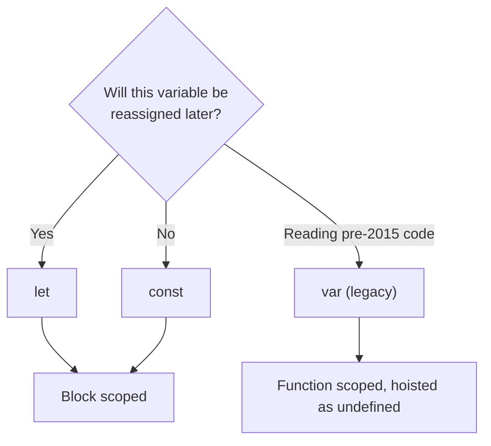

| | `var` | `let` | `const` |
|:--|:--:|:--:|:--:|
| Scope | Function | Block | Block |
| Declare twice in the same scope | ✅ Allowed | ❌ `SyntaxError` | ❌ `SyntaxError` |
| Reassign | ✅ | ✅ | ❌ `TypeError` |
| Use before the declaration line | `undefined` | ❌ `ReferenceError` | ❌ `ReferenceError` |

```js
// 02_chapter_JS_Keywrods_Identifiers/05_KW_IND.js
var v = 10;   // keyword: var,   identifier: v
let l = 10;   // keyword: let,   identifier: l
const c = 10; // keyword: const, identifier: c

// What happens when you break the rules:
// let l = 20;      SyntaxError: Identifier 'l' has already been declared
// c = 20;          TypeError: Assignment to constant variable.
```

### 06: Identifier Rules

**Concept:** An identifier must start with a letter, `_` or `$`. After the first character it may also contain digits. No spaces, no hyphens, no reserved words, and names are case sensitive.

**Why:** Breaking a rule is a `SyntaxError`, and because V8 parses the whole file first, one bad name stops the entire file from running.

**Q&A: why use this?**
- **Q: When do I reach for it?** A: Every time you name something. Check three things: the first character is a letter, `_` or `$`; the rest are letters, digits, `_` or `$`; the name is not a reserved word.
- **Q: What does it replace?** A: Nothing new if you know Java: the rules are nearly identical. Even `$` and `_` on their own are legal names (`var $ = 10; var _ = 10;`).
- **Q: What's the gotcha?** A: Names are case sensitive, so `Name` and `name` are two different variables. And the error rarely says "bad name": `var 45 = 34` throws `SyntaxError: Unexpected number`.

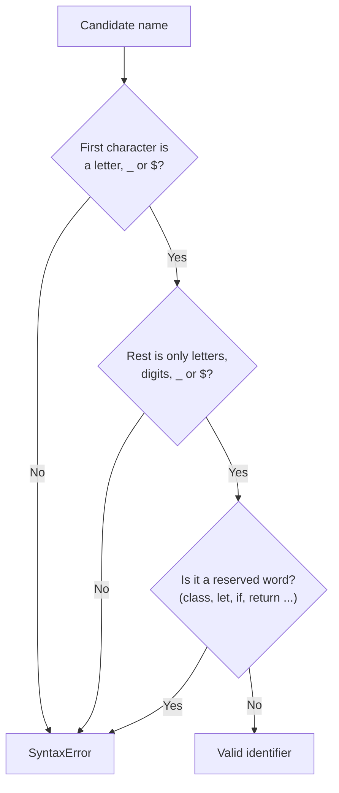

```js
// 02_chapter_JS_Keywrods_Identifiers/06_KW_IND_Rules.js (excerpt)
var a = 10;
var $ = 10;               // $ alone is a valid name
var _a = 23;
var _ = 10;               // _ alone is a valid name
var ab123 = 23;           // digits are fine after the first character

var Name = "pramod";      // Name and name are two
var name = "Amit";        // different variables

var pramod_dutta = "hello";
var pramod$dutta = "hello";

// var 45 = 34;              SyntaxError: Unexpected number
// var pramod dutta = "x";   SyntaxError: Unexpected identifier 'dutta'
```

### 07: Naming Conventions

**Concept:** Conventions are team agreements on how to write a name: camelCase for variables and functions, PascalCase for classes and constructors, SCREAMING_SNAKE_CASE for constants, snake_case mostly outside JavaScript.

**Why:** The engine accepts all of them; people reading your test need the casing to tell a class from a variable from a fixed config value at a glance.

**Q&A: why use this?**
- **Q: When do I reach for it?** A: camelCase for almost everything (`userName`, `isLoggedIn`), PascalCase for Page Object classes (`LoginPage`), SCREAMING_SNAKE_CASE for values that never change (`BASE_URL`, `MAX_RETRIES`).
- **Q: What does it replace?** A: Hungarian notation (`strName`, `bActive`, `nCount`), an older style that put the type in the name. TypeScript types do that job now, so modern style guides avoid it.
- **Q: What's the gotcha?** A: Conventions are not enforced. `This_is_a_very_long_name_variable` runs fine; only a linter (ESLint's `camelcase` rule) or a code review will catch it.

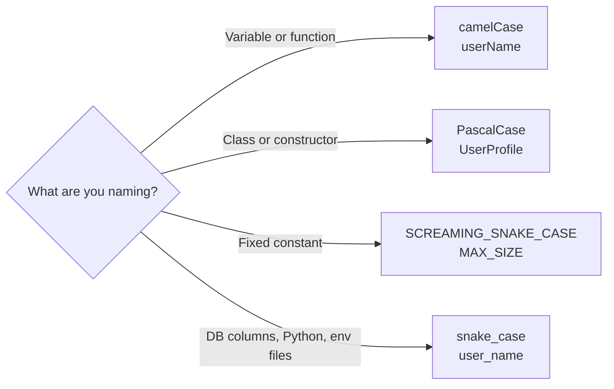

| Convention | Example | Used for in JS |
|:-----------|:--------|:---------------|
| camelCase | `totalPrice` | Variables, functions (the default) |
| PascalCase | `ShoppingCart` | Classes, constructors, Page Objects |
| SCREAMING_SNAKE_CASE | `API_KEY` | Constants and config |
| snake_case | `total_price` | Rare in JS; common in Python and SQL |
| Hungarian | `bActive` | Legacy code only |

```js
// 02_chapter_JS_Keywrods_Identifiers/07_IND_Rules2.js (excerpt)
let userName = "camelCase";          // 1. camelCase
let isLoggedIn = true;

let UserProfile = "PascalCase";      // 2. PascalCase

let user_name = "snake_case";        // 3. snake_case

const MAX_SIZE = 100;                // 4. SCREAMING_SNAKE_CASE
const API_KEY = "abc123";
// MAX_SIZE = 90;                    TypeError: Assignment to constant variable.

let strName = "string prefix";       // 5. Hungarian notation (older style)
let bActive = true;
```

### 08: Comments

**Concept:** Comments are text the engine skips. `//` comments out the rest of the line, `/* ... */` spans multiple lines, and `/** ... */` is a JSDoc block that editors like VS Code show as hover documentation.

**Why:** Comments explain why code exists, and commenting out a line is the fastest way to switch it off while debugging a test.

**Q&A: why use this?**
- **Q: When do I reach for it?** A: To explain intent, to switch a line off temporarily (`Cmd + /` on Mac, `Ctrl + /` on Windows and Linux in VS Code), and to add JSDoc to functions other people will call.
- **Q: What does it replace?** A: Nothing new if you know Java: the same `//`, `/* */` and `/** */` syntax. Javadoc becomes JSDoc.
- **Q: What's the gotcha?** A: Block comments do not nest. In `/* outer /* inner */ still code */` the comment ends at the first `*/`, so `still code */` is parsed as code and throws a `SyntaxError`.

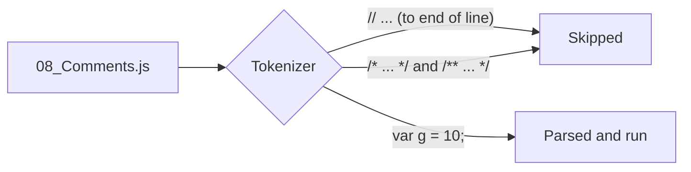

```js
// 02_chapter_JS_Keywrods_Identifiers/08_Comments.js
// This is a single-line comment, it will be ignored
// this line will not be executed

/*
 *  This is a multi-line comment
 *  Author : Pramod Dutta
 *  Date : 11-Jul-2026
 */

/**
 *  This is a JSDoc comment
 *  Author : Pramod Dutta
 *  Date : 14-Feb-2026
 **/

var g = 10; // cmd + /, ctrl + /
```

### 09: Interview Questions on Identifiers

**Concept:** A drill file of the identifier cases interviewers like to ask about: legal first characters, digits, Unicode names, escape sequences, case sensitivity, and the characters that break a name.

**Why:** These questions check whether you know the actual rule or only the everyday cases, and the edge cases (Unicode, escapes) are where people get caught.

**Q&A: why use this?**
- **Q: When do I reach for it?** A: Before an interview, or when a reviewer asks "is that even legal?". Run `node 02_chapter_JS_Keywrods_Identifiers/09_IQ.js`: it exits silently, which proves every uncommented line is valid.
- **Q: What does it replace?** A: Memorising a list. It is the same rule as lesson 06, applied to Unicode: `café` and `变量` are valid because `é` and `变` count as letters.
- **Q: What's the gotcha?** A: `let A = ...` declares a variable named `A`, because the escape is decoded before the name is checked. And `Function` is a built-in, not a reserved word: `let Function = "x"` runs and shadows the global. Reserved words such as `class` or `let` are the ones that fail.

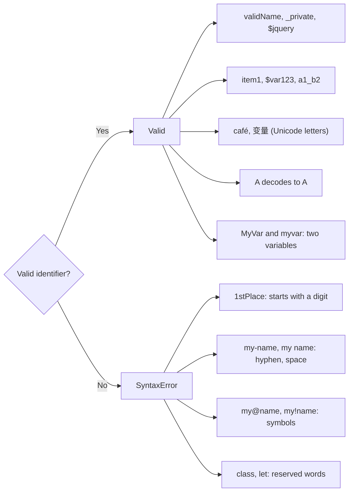

```js
// 02_chapter_JS_Keywrods_Identifiers/09_IQ.js (excerpt)
let validName = "starts with letter";
let _private = "starts with underscore";
let $jquery = "starts with dollar sign";
let a1_b2 = "mixed letters digits underscore";

// let 1stPlace = "invalid";     SyntaxError: Invalid or unexpected token

// let Function = "invalid";     but it actually works: Function is a
//                               built-in name, not a reserved word
let MyVar = "uppercase M";       // case sensitive:
let myvar = "lowercase v";       // two separate variables

let café = "Unicode letter é";
let 变量 = "Chinese characters";
let A = "Unicode escape for A";  // this variable is named A

// let my-name = "invalid";      SyntaxError: Unexpected token '-'
// let my name = "invalid";      SyntaxError: Unexpected identifier
// let my@name = "invalid";      SyntaxError: Unexpected token '@'
```

---

## Chapter 03: Literals

### 10: Literals and typeof

**Concept:** A literal is a fixed value typed straight into your code: `10`, `"pramod"`, `3.14`, `true`, `null`. `typeof` is an operator that tells you, as a string, which type a value has.

**Why:** Test data is full of literals (usernames, expected counts, flags), and `typeof` is the quickest way to check that a value read from a page or an API is the type you think it is.

**Q&A: why use this?**
- **Q: When do I reach for it?** A: When an assertion fails and you suspect a type mismatch, for example a count read from the page is `"5"` (string), not `5` (number). `console.log(typeof value)` settles it in one line.
- **Q: What does it replace?** A: Java's typed declarations (`String name = "pramod";`). In JavaScript the variable has no type, the value does, and `typeof` reads it at runtime.
- **Q: What's the gotcha?** A: `typeof null` is `"object"`, a bug from the first version of JavaScript that can never be fixed without breaking old websites. Also, `'single'` and `"double"` quotes make exactly the same string.

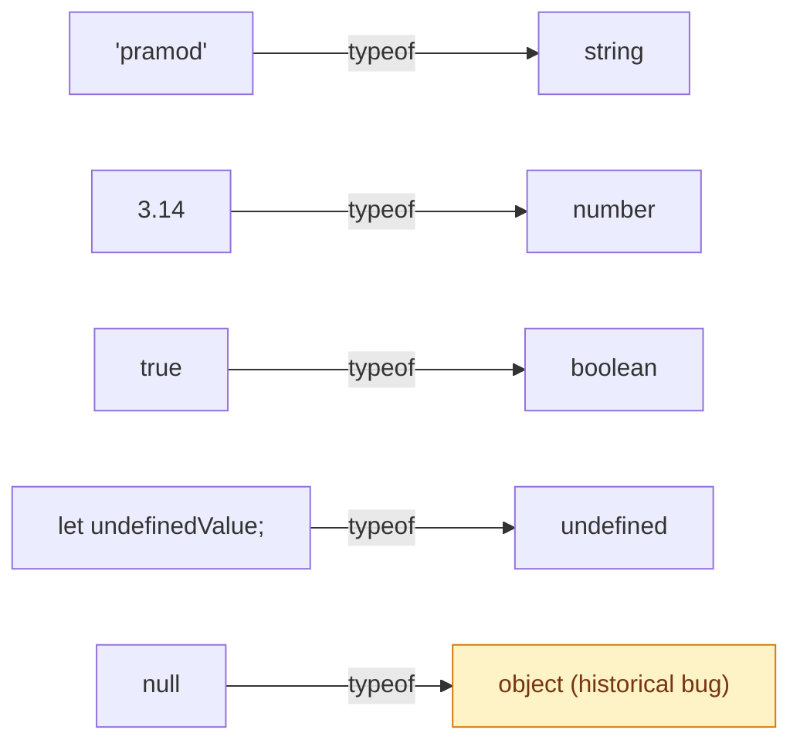

```js
// 03_chapter_JS_Literals/11_Numberal.js
let age = "pramod";     // string literal
let age2 = 'pramod';    // same string, single quotes
let isStudent = true;   // boolean literal
let pi = 3.14;          // numeric literal
let nullValue = null;   // null literal
let undefinedValue;     // no literal: JavaScript fills in undefined

console.log(typeof age);            // string
console.log(typeof age2);           // string
console.log(typeof pi);             // number
console.log(typeof isStudent);      // boolean
console.log(typeof nullValue);      // object
console.log(typeof undefinedValue); // undefined
```

`10_Literal.js` is the one-line version: in `let a = 10;` the literal is `10`.

### 12: null vs undefined

**Concept:** `undefined` means a variable exists but nothing has been assigned to it yet, and JavaScript sets it for you. `null` means "intentionally empty", and only you (or an API) set it.

**Why:** Both show up whenever a value might be missing (an optional field in an API response, an attribute that is not on the element), and they behave differently in comparisons.

**Q&A: why use this?**
- **Q: When do I reach for it?** A: Assign `null` when you mean "no value, on purpose" (`let profilePicture = null`). Leave `undefined` to JavaScript. In Playwright, `locator.getAttribute('href')` resolves to `null` when the attribute is missing.
- **Q: What does it replace?** A: Java has only `null`. JavaScript splits "not set yet" (`undefined`) from "deliberately empty" (`null`).
- **Q: What's the gotcha?** A: `null == undefined` is `true` but `null === undefined` is `false`, and `typeof null` is `"object"`. To test for null, write `value === null`; `typeof` cannot tell you.

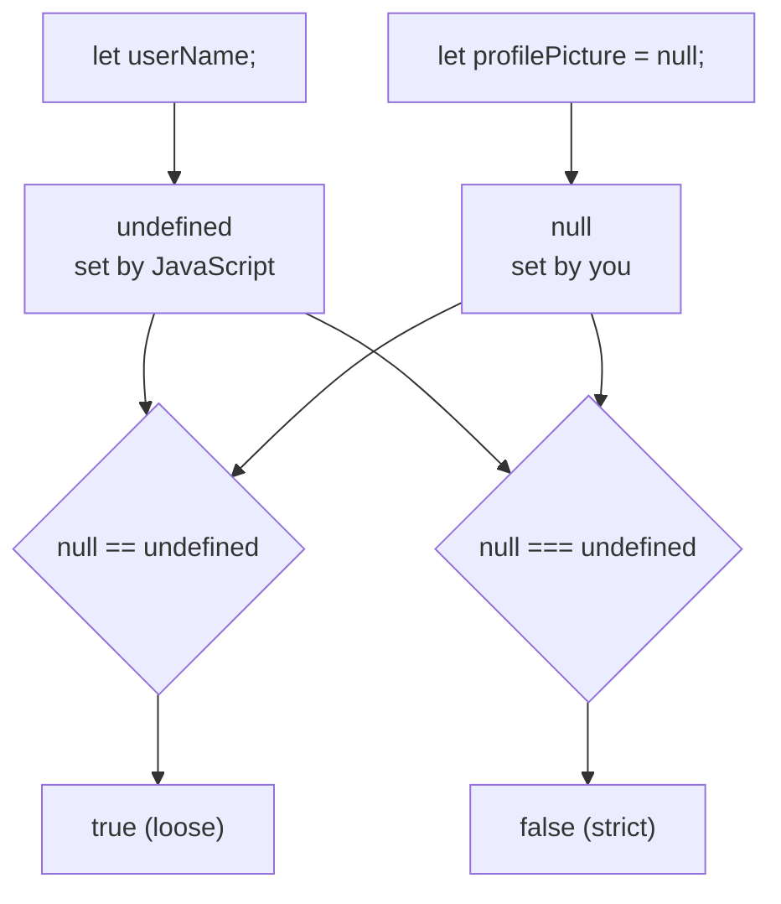

| Feature | `undefined` | `null` |
|:--------|:------------|:-------|
| Meaning | Not assigned yet | Intentionally empty |
| Who sets it? | JavaScript, automatically | The developer, manually |
| `typeof` | `"undefined"` | `"object"` (historical bug) |
| `null == undefined` | `true` | `true` |
| `null === undefined` | `false` | `false` |

```js
// 03_chapter_JS_Literals/12_Null_Undefined.js (excerpt)
let userName;                       // declared but not assigned
console.log(userName);              // undefined
console.log(typeof userName);       // undefined

let x;
x = 10;
console.log(x);                     // 10

let profilePicture = null;          // intentionally empty
console.log(profilePicture);        // null
console.log(typeof profilePicture); // object   <-- known JS quirk!
```

`13_Null.js` and `18_undefined.js` are two-line practice files: one variable left `undefined`, one set to `null`.

### 14: Number Literals: Bases and Exponents

**Concept:** JavaScript has one `number` type for whole numbers and decimals alike. You can write the same number in decimal (`42`), binary (`0b101010`), octal (`0o52`) or hex (`0x2A`), and very large or very small numbers in exponent form (`1.5e3`, `1.5e-4`).

**Why:** Hex shows up in colour codes (`0xFF0000`), exponent form keeps big values readable (`1e6`), and all of them are plain `number` underneath, so they mix freely.

**Q&A: why use this?**
- **Q: When do I reach for it?** A: Hex for colours and byte values, exponent form for very large or very small numbers, plain decimal for everything else.
- **Q: What does it replace?** A: Java's `int`, `long`, `float` and `double`. JavaScript has one `number` type (a 64-bit float), so `typeof 0xFF` is `"number"` and `5.` is the same value as `5`.
- **Q: What's the gotcha?** A: Always write octal with the `0o` prefix. A legacy leading zero (`017`) silently means 15 in a normal script and is a `SyntaxError` in strict mode. And skip `.5` and `5.`: they are valid but easy to misread.

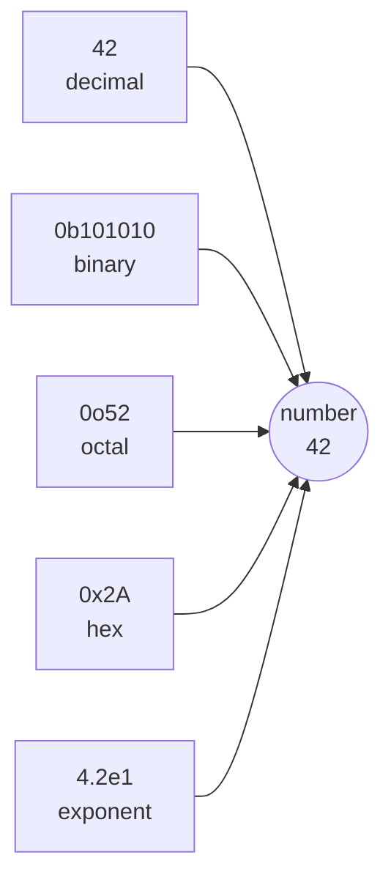

| Prefix | Base | Example | Value |
|:------:|:-----|:--------|:-----:|
| (none) | 10, decimal | `42` | 42 |
| `0b` | 2, binary | `0b1010` | 10 |
| `0o` | 8, octal | `0o52` | 42 |
| `0x` | 16, hex | `0x2A` | 42 |
| `e` | exponent (x 10ⁿ) | `1.5e3` | 1500 |

```js
// 03_chapter_JS_Literals/15_Number.js (excerpt)
let decimal = 42;
let binary = 0b1010;  // 10 in decimal
let octal = 0o52;     // 42 in decimal
let hex = 0x2A;       // 42 in decimal
console.log(decimal, binary, octal, hex);  // 42 10 42 42

let float1 = 3.14;
let float3 = .5;      // valid, but avoid for readability
let float4 = 5.;      // valid, but avoid for readability
console.log(float1, float3, float4);       // 3.14 0.5 5

let exp1 = 1.5e3;     // 1.5 * 10^3  = 1500
let exp2 = 1.5e-3;    // 1.5 * 10^-3 = 0.0015
let exp3 = 2E10;      // 2 * 10^10   = 20000000000
console.log(exp1, exp2, exp3);             // 1500 0.0015 20000000000

let h = 0xFF;         // from 14_Literals.js
console.log(typeof h);                     // number
```

### 16: Numeric Separators and BigInt

**Concept:** Underscores inside a number literal (`1_000_000`) are visual separators that the engine ignores. BigInt is a separate type for whole numbers too big for `number`: add an `n` to the end (`123n`) or call `BigInt("...")`.

**Why:** Separators make long numbers readable at a glance, and BigInt keeps very large integers exact where `number` would silently round them.

**Q&A: why use this?**
- **Q: When do I reach for it?** A: Separators in any long constant (`const TIMEOUT_MS = 30_000`). BigInt when an integer can go past `Number.MAX_SAFE_INTEGER` (9,007,199,254,740,991), for example 64-bit database IDs.
- **Q: What does it replace?** A: Java's `BigInteger`, but with literal syntax (`10n`) and the normal operators (`+`, `*`, `/`) instead of method calls.
- **Q: What's the gotcha?** A: You cannot mix the two types: `1n + 1` throws `TypeError: Cannot mix BigInt and other types`. And separators only work in code: `Number("1_000")` is `NaN`.

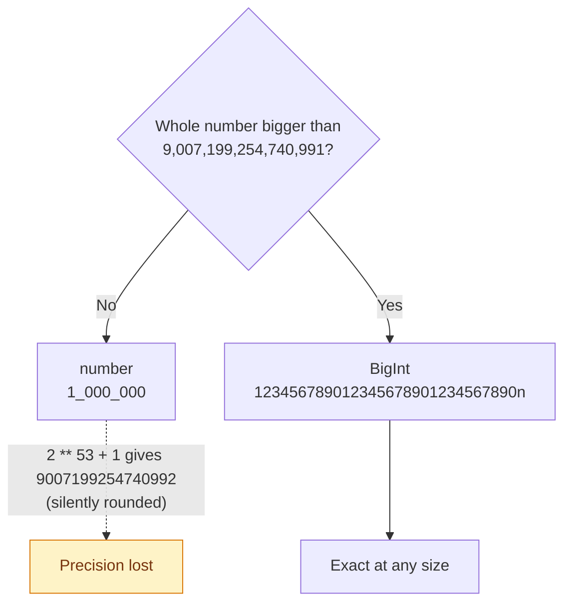

```js
// 03_chapter_JS_Literals/16_Numbers_PART2.js
let million = 1_000_000;      // same as 1000000
let binarySep = 0b1010_0001;
let hexSep = 0xFF_FF;

let big = 123456789012345678901234567890n;
let big2 = BigInt("123456789012345678901234567890");
let bigFromNum = BigInt(42);

console.log("BigInt literal:", big);          // 123456789012345678901234567890n
console.log("BigInt from string:", big2);     // 123456789012345678901234567890n
console.log("BigInt from number:", bigFromNum); // 42n
console.log("typeof BigInt:", typeof big);    // bigint
```

### 17: Special Numbers: Infinity and NaN

**Concept:** `Infinity`, `-Infinity` and `NaN` (Not a Number) are special values of type `number`. Dividing by zero gives `Infinity`; math with no numeric answer, like `0 / 0` or `"hello" * 2`, gives `NaN`.

**Why:** JavaScript never throws on bad arithmetic. It returns one of these values and keeps going, so a test can quietly compute `NaN` unless you check for it.

**Q&A: why use this?**
- **Q: When do I reach for it?** A: Whenever you convert page text to a number (`Number(priceText)`), check the result with `Number.isNaN()` before you assert on it.
- **Q: What does it replace?** A: Java's `ArithmeticException` on integer divide-by-zero. JavaScript has no arithmetic exceptions; you get `Infinity` or `NaN` back instead.
- **Q: What's the gotcha?** A: `NaN` is not equal to anything, itself included: `NaN === NaN` is `false`. Use `Number.isNaN(x)`. The older global `isNaN("hello")` returns `true` because it converts the string first.

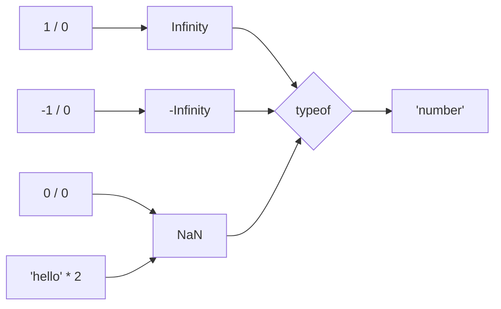

```js
// 03_chapter_JS_Literals/17_Special.js
console.log("Infinity:", Infinity);               // Infinity
console.log("1 / 0:", 1 / 0);                     // Infinity
console.log("-1 / 0:", -1 / 0);                   // -Infinity
console.log("typeof Infinity:", typeof Infinity); // "number"

console.log("NaN:", NaN);                         // NaN
console.log("0 / 0:", 0 / 0);                     // NaN
console.log("'hello' * 2:", "hello" * 2);         // NaN
console.log("typeof NaN:", typeof NaN);           // "number" (quirky!)
```

---

## Chapter 04: Operators

### 19: Expressions and Data Types

**Concept:** An expression combines values (operands) with operators to produce a new value. `let a = 10 + 3;` uses two operators: `+` computes `13`, then `=` stores it in `a`. Every value has one of eight types: seven primitives (`string`, `number`, `boolean`, `bigint`, `undefined`, `null`, `symbol`) plus `object`.

**Why:** Operators behave differently depending on the types of their operands, so the type list comes before the operator lessons.

**Q&A: why use this?**
- **Q: When do I reach for it?** A: Whenever an operator gives a surprising result, ask "what types are the operands?" first. `"5" + 1` is `"51"`, but `"5" - 1` is `4`.
- **Q: What does it replace?** A: Java's long list of numeric types (`byte`, `short`, `int`, `long`, `float`, `double`, `char`). JavaScript collapses them into `number` and `bigint` and has no `char`.
- **Q: What's the gotcha?** A: Arrays, `NaN` and `Infinity` are not types of their own. Arrays are objects (`typeof []` is `"object"`, so use `Array.isArray()`), and `NaN` and `Infinity` are values of type `number`.

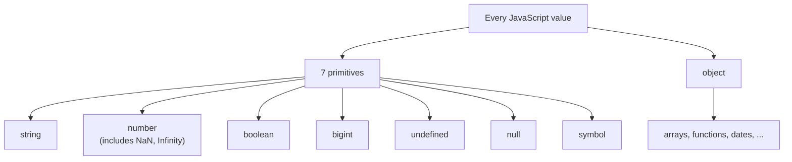

```js
// 04_chapter_JS_Operators/19_Arch.js (expanded)
let a = 10 + 3;     // 2 operators: + computes 13, = stores it
console.log(a);     // 13

console.log(typeof "pramod");     // string
console.log(typeof 42);           // number
console.log(typeof true);         // boolean
console.log(typeof 42n);          // bigint
console.log(typeof undefined);    // undefined
console.log(typeof null);         // object (null is still its own type)
console.log(typeof Symbol("id")); // symbol
console.log(typeof [1, 2, 3]);    // object (arrays are objects)
console.log(typeof NaN);          // number
```

### 20: Assignment Operators

**Concept:** `=` stores the value on its right in the variable on its left. A `let` variable can be reassigned, even to a value of a different type, and `x1 = x1 + 5` reads the old value, adds 5, and stores the result back.

**Why:** Counters, running totals and retry loops in tests all update a variable from its own previous value.

**Q&A: why use this?**
- **Q: When do I reach for it?** A: Every time you store or update a value. For updates, the compound forms say the same thing in less code: `x1 += 5` is `x1 = x1 + 5`.
- **Q: What does it replace?** A: The same `=` and compound operators as Java, minus the type check. JavaScript lets `x` go from `10` to `"PrrammodDutta"` without complaint; TypeScript brings that check back.
- **Q: What's the gotcha?** A: `=` assigns, `==` and `===` compare. `if (x = 5)` assigns 5 and is always true, a classic bug that JavaScript does not flag.

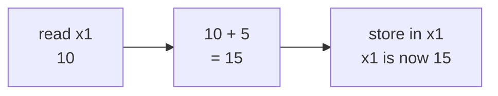

| Operator | Same as | Example (`x = 10`) | Result |
|:--------:|:--------|:-------------------|:------:|
| `=` | | `x = 5` | 5 |
| `+=` | `x = x + n` | `x += 5` | 15 |
| `-=` | `x = x - n` | `x -= 5` | 5 |
| `*=` | `x = x * n` | `x *= 2` | 20 |
| `/=` | `x = x / n` | `x /= 4` | 2.5 |
| `%=` | `x = x % n` | `x %= 3` | 1 |
| `**=` | `x = x ** n` | `x **= 2` | 100 |

```js
// 04_chapter_JS_Operators/20_Assigment_Op.js
let x = 10;
x = "PrrammodDutta";   // let allows a new value, even a new type
console.log(x);        // PrrammodDutta

let x1 = 10;
x1 = x1 + 5;           // read 10, add 5, store 15
console.log(x1);       // 15

x1 += 5;               // shorthand for x1 = x1 + 5
console.log(x1);       // 20
```

### 21: Arithmetic Operators

**Concept:** `+`, `-`, `*` and `/` do the usual math, `%` (modulus) gives the remainder after division, and `**` raises to a power. Division never truncates: `10 / 3` is `3.3333333333333335`.

**Why:** Tests compute expected values all the time (totals, page counts, even/odd rows), and `%` answers "is this even?" in one expression.

**Q&A: why use this?**
- **Q: When do I reach for it?** A: `%` for even/odd checks (`n % 2 === 0` means even), `**` for powers (`2 ** 3` is 8), and `/` with `Math.ceil` for page counts (`Math.ceil(25 / 10)` is 3 pages).
- **Q: What does it replace?** A: Java's integer division: in Java `10 / 3` is `3`, in JavaScript it is `3.3333333333333335`. Use `Math.floor()` or `Math.trunc()` to drop the decimals. `**` replaces `Math.pow()`.
- **Q: What's the gotcha?** A: `%` keeps the sign of the left side: `-7 % 2` is `-1`, so the odd check `n % 2 == 1` fails for negative numbers. Write `n % 2 !== 0` for odd.

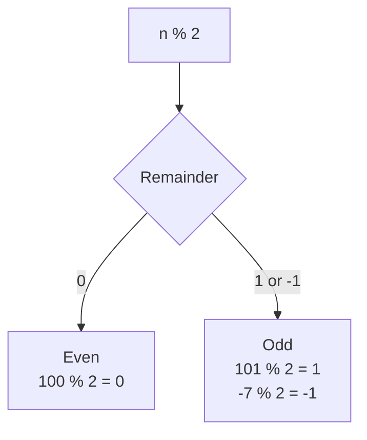

```js
// 04_chapter_JS_Operators/21_Arithematic_Op.js
let a = 10;
let b = 3;

console.log(a + b);   // 13
console.log(a - b);   // 7
console.log(a * b);   // 30
console.log(a / b);   // 3.3333333333333335

// Modulus -> % -> gives you the remainder
console.log(a % b);   // 1
console.log(13 % 7);  // 6
console.log(101 % 2); // 1  -> odd
console.log(100 % 2); // 0  -> even

// Exponential ** -> power, 2^3 = 8
console.log(2 ** 3);  // 8
console.log(a ** b);  // 1000 (10^3)
```

### 22: Comparison Operators (Loose vs Strict)

**Concept:** Comparison operators always return a boolean. `==` (loose) converts both sides to the same type before comparing; `===` (strict) compares both value and type with no conversion. `!=` and `!==` are their "not equal" versions, and `>`, `<`, `>=`, `<=` compare order.

**Why:** Assertions are comparisons, and loose equality can let a wrong value pass: `5 == "5"` is `true`.

**Q&A: why use this?**
- **Q: When do I reach for it?** A: Use `===` and `!==` by default. Playwright's `expect(x).toBe(y)` is strict as well (it uses `Object.is`), so `expect("5").toBe(5)` fails.
- **Q: What does it replace?** A: Java's `==` vs `.equals()` split. In JavaScript, `===` compares primitive values directly, so `"abc" === "abc"` is `true` with no `.equals()` call.
- **Q: What's the gotcha?** A: `>=` is not simply "`>` or `==`": `null >= 0` is `true` while `null == 0` is `false`, because the relational operators convert `null` to `0` and `==` does not.

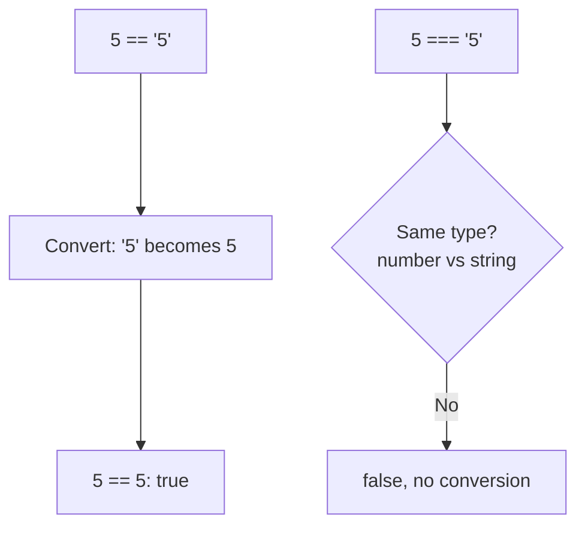

| Operator | Name | `5` vs `"5"` | Result |
|:--------:|:-----|:-------------|:------:|
| `==` | Loose equal | `5 == "5"` | `true` |
| `===` | Strict equal | `5 === "5"` | `false` |
| `!=` | Loose not equal | `5 != "5"` | `false` |
| `!==` | Strict not equal | `5 !== "5"` | `true` |

```js
// 04_chapter_JS_Operators/22_Comparsion_Op.js (excerpt)
console.log(3 > 4);      // false
console.log(3 < 4);      // true
console.log(4 >= 4);     // true

console.log(5 == "5");   // true:  loose, compares value only
console.log(5 === "5");  // false: strict, value + data type

console.log(5 != "5");   // false
console.log(5 !== "5");  // true
console.log(5 === 5);    // true
```

### 23: Logical Operators

**Concept:** `&&` (AND) is true only when both sides are true, `||` (OR) is true when at least one side is true, and `!` (NOT) flips a boolean.

**Why:** Real conditions are rarely a single check: "logged in AND cart not empty", "on staging OR on dev".

**Q&A: why use this?**
- **Q: When do I reach for it?** A: Combining conditions in an `if`, and `||` for defaults: `const baseUrl = process.env.BASE_URL || "http://localhost:3000"`.
- **Q: What does it replace?** A: The same symbols as Java, but JavaScript returns one of the operands, not always a boolean: `"a" && "b"` is `"b"` and `null || "guest"` is `"guest"`. Both short-circuit: the right side only runs when it is needed.
- **Q: What's the gotcha?** A: `||` treats every falsy value (`0`, `""`, `null`, `undefined`, `NaN`, `false`) as missing, so `0 || 5` is `5`. When `0` or `""` is a valid value, use `??` instead: `0 ?? 5` is `0`.

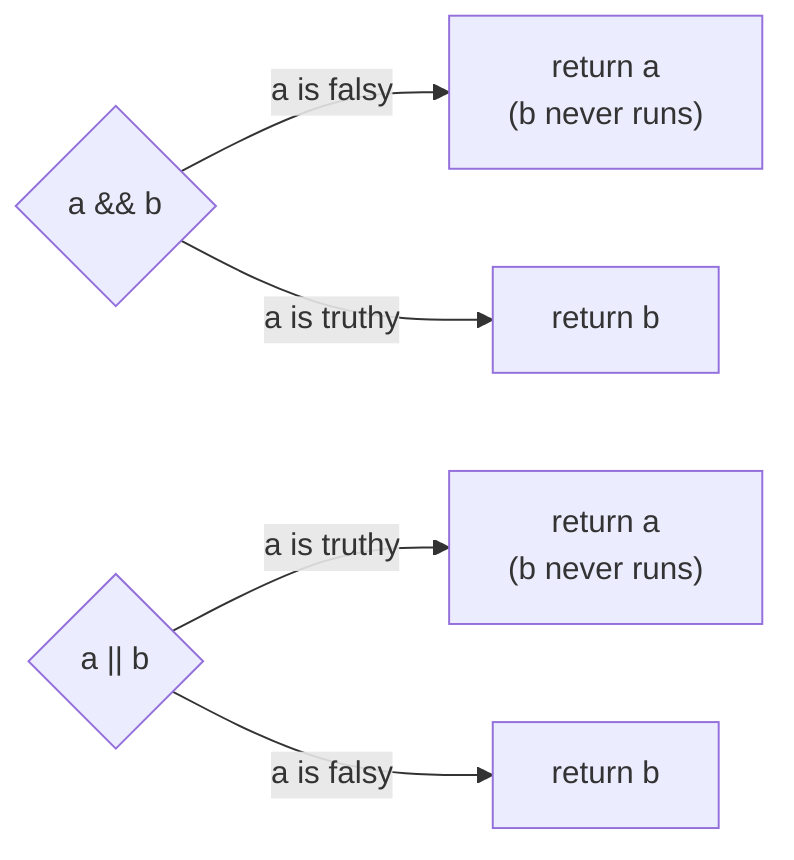

| `a` | `b` | `a && b` | `a \|\| b` | `!a` |
|:---:|:---:|:--------:|:----------:|:----:|
| `true` | `true` | `true` | `true` | `false` |
| `true` | `false` | `false` | `true` | `false` |
| `false` | `true` | `false` | `true` | `true` |
| `false` | `false` | `false` | `false` | `true` |

```js
// 04_chapter_JS_Operators/23_Logical_Op.js (plus short-circuit examples)
let a = true;
let b = false;

console.log(a && b);           // false
console.log(a || b);           // true
console.log(!a);               // false

console.log(null || "guest");  // guest (default value)
console.log(0 || 5);           // 5, because 0 is falsy
console.log(0 ?? 5);           // 0, ?? only replaces null/undefined
```

### 24: Confusing Comparisons

**Concept:** Because `==` converts types before comparing, it breaks rules you expect from math. `"" == 0` and `"0" == 0` are both `true`, yet `"" == "0"` is `false`, so equality is no longer transitive.

**Why:** These are the classic interview traps, and the same conversion can make a test pass when the page shows `""` where you expected `0`.

**Q&A: why use this?**
- **Q: When do I reach for it?** A: In interviews, and when reviewing code that uses `==`. The fix is always the same: switch to `===`.
- **Q: What does it replace?** A: Guessing. The rule: when one side is a number, `==` converts the other side to a number (`""` becomes `0`, `"0"` becomes `0`); two strings are compared as text, character by character.
- **Q: What's the gotcha?** A: The same rule creates more traps: `[] == false` is `true`, `null == 0` is `false` while `null >= 0` is `true`, and `NaN == NaN` is `false`.

```mermaid
flowchart TD
    E["empty string ''"] -->|"== 0: converted to number"| Z(("0"))
    S["string '0'"] -->|"== 0: converted to number"| Z
    E -.->|"'' == '0': both strings,<br/>compared as text"| F["false"]:::warn

    classDef warn fill:#fef3c7,stroke:#d97706,color:#78350f
```

```js
// 04_chapter_JS_Operators/24_Confusing_Comparsion.js
// Rule of thumb:
//   ==   → loose equality  (does type coercion, surprising)
//   ===  → strict equality (no coercion, what you usually want)

console.log("" == 0);    // true, "" coerced to Number → 0
console.log("0" == 0);   // true, "0" coerced to Number → 0
console.log("" == "0");  // false, both strings, compared as-is
// (transitivity broken) -> coerced

// === fixes it
console.log("" === 0);   // false
console.log("0" === 0);  // false
console.log("" === "0"); // false
```

---

## Coming Up

- **Chapter 04: Operators** continues: `25_CC.js` is still empty.
- Then TypeScript, then Playwright.
